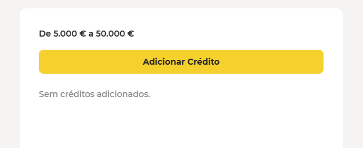
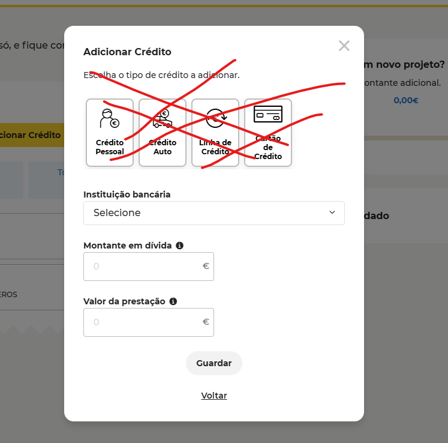
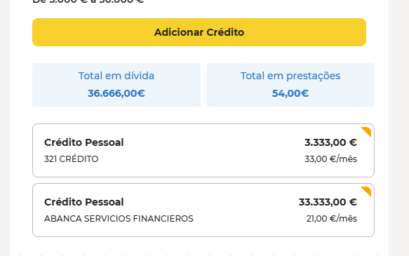

# Introduction

This repository is a base for an exercise where we want candidates to demonstrate their technical skills.

Clone the repo and execute the exercise. In the end, share the code with us via your own personal repo 

# The challenge
    
   Imagine a credit simulator with multiple steps. The main ideia consists in gathering information about the current credits of a new customer in the first step
    
      At this exercice we only be focus in first step (so, no need to add logic for steps).
      Images bellow are representative to ilustrate the goal, please follow what is written as requeriments only to keep it simple. 
      If there is time left, you're free to match the best possible some details visible in images or considering more requirements not written here.
    

   - Requirements

      - This step will have at the beginning only a button, that will trigger a popup (see similar image bellow). The button will be always present to be possible to add more credits
      

      - The popup will have a form with related information about a customer current credit. It should be possible for the user to select the "Instituição bancária" from a dropdown, write only numbers in "Montante em dívida" input and only numbers in "Valor da prestação" input. Consider two buttons at the end of the popup, one will close the popup with no further actions, and the other will save the form values in the app (consider some state management at your choice) and close the modal (see image bellow)
      

      - After close the modal, the new costumer can see each credit he has added and the sum of "Total em dívida" and sum "Total em prestações".(image below is just representative, is not mandatory to copy styles and layout. Display the way will be more faster for finishing the goal)
      

   
 - Tech notes:
    - The repository already has shadcn/ui configured, so if you have experience on it, go ahead, otherwise the ideia is to use a component lib at your choice in a way your are confortable and reduce time with investigation or even technical details
    - We want to see how you handle hooks, state among other tecnical details
    - Use Typescript
    - We have already a api mock in place so you can consume. Just run `pnpm run mock`. The endpoint is at http://localhost:3001/instituicoes

    GOOD LOOK!